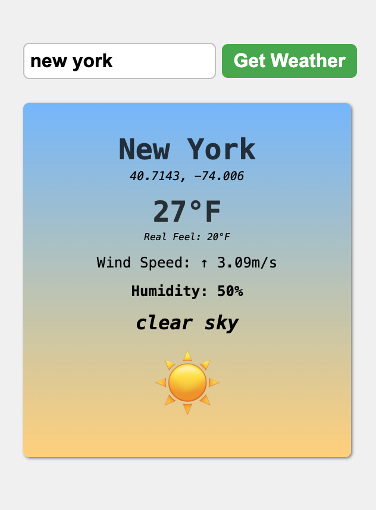

# React Weather App

A modern weather application built with **React** using hooks and the **OpenWeatherMap API**. Search any city to view real-time weather conditions including temperature, humidity, wind speed/direction, and weather-specific emojis with a beautiful gradient card design.

## Features
- 🌍 Search weather by city name worldwide
- 🌡️ Real-time temperature in Fahrenheit with "feels like" value
- 💧 Humidity percentage display
- 💨 Wind speed (m/s) and direction with arrow indicators
- 🌤️ Weather condition description and emoji
- 📍 Geographic coordinates (latitude/longitude)
- 🎨 Gradient card design (blue to yellow)
- ⚠️ Comprehensive error handling with user-friendly messages
- 🔄 Async/await for smooth API data fetching
- ⚛️ Built with React hooks (`useState`, `useRef`)
- ✨ Conditional rendering (shows weather or error, not both)

## Requirements
- Node.js (v14 or higher)
- npm or yarn package manager
- React (v18 or higher recommended)
- Active internet connection
- OpenWeatherMap API key (included)

## Project structure
```
.
├── src/
│   ├── App.jsx
│   ├── WeatherApp.jsx
│   ├── index.css
│   └── main.jsx (or index.jsx)
├── package.json
└── README.md
```

## Installation

1. **Clone or download the project**

2. **Install dependencies**
```bash
npm install
# or
yarn install
```

3. **Run the development server**
```bash
npm run dev
# or
yarn dev
```

4. **Open in browser**
Navigate to `http://localhost:5173` (or the port shown in your terminal)

## Screenshots


* The weather interface features:
  - **Search form** at the top with large input field and green button
  - **Weather card** with gradient background (blue to yellow)
  - **City name** (3rem, bold, dark text)
  - **Coordinates** (1.25rem, italic) - latitude, longitude
  - **Temperature** (3rem, bold) - in Fahrenheit
  - **Real Feel** (1rem, italic) - perceived temperature
  - **Wind Speed** (bold) - direction arrow + speed in m/s
  - **Humidity** (bold) - percentage
  - **Description** (2rem, italic, bold) - weather condition
  - **Weather Emoji** (7rem) - visual representation
  - **Error messages** (2.5rem, bold) when city not found
  - **Light gray background** (`hsl(0, 0%, 95%)`)

## Usage

### Searching for weather
1. Enter a city name in the input field (e.g., "London", "Tokyo", "New York")
2. Click **Get Weather** button or press Enter
3. View the weather information displayed on the gradient card
4. Search for another city to update the display

### Error handling
- Empty input shows: "Please Enter a City"
- Invalid city shows: "Could Not Fetch Weather"
- Network errors are caught and displayed gracefully

## Component Architecture

### App.jsx
Main application component that renders WeatherApp:
```javascript
import WeatherApp from "./WeatherApp.jsx"

function App() {
    return <WeatherApp />;
}
```

### WeatherApp.jsx
Core component containing all weather functionality:

**State Management:**
```javascript
const [city, setCity] = useState("");
const [weather, setWeather] = useState(null);
const [error, setError] = useState("");
const cityInputRef = useRef(null);
```

**State Variables:**
- `city`: String storing current input value (controlled component)
- `weather`: Object storing all weather data (null when no data)
- `error`: String storing error messages (empty when no error)

**Ref Variable:**
- `cityInputRef`: Reference to input element (for potential focus control)

## API Integration

### OpenWeatherMap API
Uses the Current Weather Data API endpoint:
```javascript
const API_KEY = "0b27dee62b5909ebbbf9788a2e85e2b2";
const apiUrl = `https://api.openweathermap.org/data/2.5/weather?q=${city}&appid=${API_KEY}`;
```

**Note**: The included API key is for demonstration. For production use, register for your own free API key at [OpenWeatherMap](https://openweathermap.org/api).

## Key Functions

### 1. handleSubmit(e)
Handles form submission and orchestrates the weather fetch:
```javascript
async function handleSubmit(e) {
    e.preventDefault();
    
    if (!city.trim()) {
        displayError("Please Enter a City");
        return;
    }

    setError("");

    try {
        const data = await getWeatherData(city.trim());
        displayWeatherInfo(data);
    }
    catch (err) {
        displayError("Could Not Fetch Weather");
    }
}
```

**Flow:**
- Prevents form refresh with `e.preventDefault()`
- Validates input is not empty (uses `trim()`)
- Clears previous errors
- Fetches weather data asynchronously
- Displays weather or error based on result

### 2. getWeatherData(city)
Fetches weather data from OpenWeatherMap API:
```javascript
async function getWeatherData(city) {
    const apiUrl = `https://api.openweathermap.org/data/2.5/weather?q=${city}&appid=${API_KEY}`;
    const response = await fetch(apiUrl);

    if(!response.ok) {
        throw new Error("Could Not Fetch Weather Data");
    }

    const data = await response.json();
    return data;
}
```

**Process:**
- Constructs API URL with city and API key
- Fetches data using native `fetch()` API
- Validates response status
- Throws error if fetch fails
- Returns parsed JSON data

### 3. displayWeatherInfo(data)
Processes and displays weather data:
```javascript
function displayWeatherInfo(data) {
    setError("");

    const {
        name,
        coord: {lat, lon},
        main: {temp, feels_like, humidity},
        weather: [{id, description}],
        wind: {speed, deg}
    } = data;

    const tempF = kelvToFaren(temp);
    const feelsLikeF = kelvToFaren(feels_like);
    const windDirection = getWindDirection(deg);
    const emoji = getWeatherEmoji(id);

    setWeather({
        city: name,
        lat, lon,
        temp: tempF,
        feelsLike: feelsLikeF,
        windSpeed: speed,
        windDirection,
        humidity,
        description,
        emoji
    });
}
```

**Process:**
- Clears any previous errors
- Destructures relevant data from API response
- Converts temperatures using helper function
- Gets wind direction arrow from degrees
- Gets weather emoji based on condition ID
- Sets weather state with processed data

### 4. kelvToFaren(k)
Converts Kelvin to Fahrenheit:
```javascript
function kelvToFaren(k) {
    return (((k - 273.15) * 9) / 5 + 32).toFixed(0);
}
```

**Formula:**
1. Convert Kelvin to Celsius: `k - 273.15`
2. Convert Celsius to Fahrenheit: `(c × 9/5) + 32`
3. Round to whole number with `toFixed(0)`

**Example:**
- 300K → 26.85°C → 80°F

### 5. getWeatherEmoji(weatherId)
Returns emoji based on OpenWeatherMap condition ID:
```javascript
function getWeatherEmoji(weatherId) {
    if (weatherId >= 200 && weatherId < 300) {
        return "⛈️"; // Thunderstorm
    }
    else if (weatherId >= 300 && weatherId < 400) {
        return "🌦️"; // Drizzle
    }
    else if (weatherId >= 500 && weatherId < 600) {
        return "🌧️"; // Rain
    }
    else if (weatherId >= 600 && weatherId < 700) {
        return "❄️"; // Snow
    }
    else if (weatherId >= 700 && weatherId < 800) {
        return "🌫️"; // Fog / Haze
    }
    else if (weatherId === 800) {
        return "☀️"; // Clear sky
    }
    else if (weatherId > 800) {
        return "☁️"; // Clouds
    }
    else {
        return "❓"; // Unknown
    }
}
```

**Weather ID Ranges:**
- **200-299**: Thunderstorm ⛈️
- **300-399**: Drizzle 🌦️
- **500-599**: Rain 🌧️
- **600-699**: Snow ❄️
- **700-799**: Fog/Haze 🌫️
- **800**: Clear ☀️
- **801-809**: Cloudy ☁️
- **Other**: Unknown ❓

### 6. getWindDirection(deg)
Converts wind degree (0-360) to directional arrow:
```javascript
function getWindDirection(deg) {
    if (deg >= 337.5 || deg < 22.5) {
        return "↑"; // North
    }
    else if (deg >= 22.5 && deg < 67.5) {
        return "↗"; // Northeast
    }
    // ... more directions
    else {
        return "•"; // Calm/No direction
    }
}
```

**Compass Directions:**
- **337.5-22.5°**: ↑ North
- **22.5-67.5°**: ↗ Northeast
- **67.5-112.5°**: → East
- **112.5-157.5°**: ↘ Southeast
- **157.5-202.5°**: ↓ South
- **202.5-247.5°**: ↙ Southwest
- **247.5-292.5°**: ← West
- **292.5-337.5°**: ↖ Northwest
- **Default**: • Calm

### 7. displayError(message)
Displays error and hides weather data:
```javascript
function displayError(message) {
    setWeather(null);
    setError(message);
}
```

**Logic:**
- Clears weather data (hides weather card content)
- Sets error message (displays error in card)
- Ensures only weather OR error is shown, never both

## Conditional Rendering

The weather card uses conditional rendering:
```javascript
<div className="weather-card">
    {weather && (
        <>
            {/* Weather data JSX */}
        </>
    )}
    {error && <p className="errorDisplay">{error}</p>}
</div>
```

**Logic:**
- `weather &&` - Only renders weather content if `weather` is truthy (not null)
- `error &&` - Only renders error message if `error` is truthy (not empty string)
- Card always renders but content changes based on state
- Uses React Fragment (`<>`) to group multiple elements

## Controlled Component Pattern

The input field is a controlled component:
```javascript
<input 
    type="text" 
    value={city} 
    onChange={(e) => setCity(e.target.value)}
/>
```

**Benefits:**
- React state is the single source of truth
- Enables input validation before submission
- Allows programmatic clearing of input
- Provides predictable behavior

## Data Flow

1. **User enters city** → Updates `city` state via onChange
2. **User submits form** → `handleSubmit` is triggered
3. **Input validation** → Checks for empty/whitespace
4. **API call** → `getWeatherData` fetches data
5. **Data processing** → `displayWeatherInfo` transforms data
6. **State update** → `setWeather` triggers re-render
7. **Display** → Conditional rendering shows weather card

## Error Handling

### Three layers of error handling:

**1. Input Validation**
```javascript
if (!city.trim()) {
    displayError("Please Enter a City");
    return;
}
```

**2. API Response Validation**
```javascript
if(!response.ok) {
    throw new Error("Could Not Fetch Weather Data");
}
```

**3. Try-Catch Block**
```javascript
try {
    const data = await getWeatherData(city.trim());
    displayWeatherInfo(data);
}
catch (err) {
    displayError("Could Not Fetch Weather");
}
```

## Styling

### Color Scheme
- **Background**: Light gray (`hsl(0, 0%, 95%)`)
- **Submit button**: Green (`hsl(122, 39%, 50%)`)
- **Weather card**: Gradient (blue `hsl(210, 100%, 75%)` to yellow `hsl(40, 100%, 75%)`)
- **Text**: Dark gray with 75% opacity
- **Input border**: Dark gray with 30% opacity

### Layout
- **Flexbox**: Centers content vertically and horizontally
- **Min-height**: 90vh (almost full viewport)
- **Card padding**: 50px for spacious feel
- **Margins**: Consistent spacing throughout

### Effects
- **Box shadow**: `2px 2px 5px` for depth
- **Border radius**: 10px for rounded corners
- **Hover**: Darker green on submit button

## Customize

### API Key
Replace with your own key:
```javascript
const API_KEY = "your_api_key_here";
```

### Temperature Unit
Switch to Celsius:
```javascript
function kelvToCelsius(k) {
    return (k - 273.15).toFixed(0);
}
```

Or add toggle functionality for user preference.

### Colors
Modify gradient in `index.css`:
```css
.weather-card {
    background: linear-gradient(180deg, 
        hsl(210, 100%, 75%),  /* Top color */
        hsl(40, 100%, 75%)     /* Bottom color */
    );
}
```

Change button color:
```css
button[type="submit"] {
    background-color: hsl(200, 50%, 50%); /* Blue instead of green */
}
```

### Font Sizes
Adjust display sizes in `index.css`:
```css
.cityDisplay { font-size: 4rem; } /* Larger */
.weatherEmoji { font-size: 10rem; } /* Bigger emoji */
```

### Add More Data
Display additional API data by extending `displayWeatherInfo`:
```javascript
const {
    main: {temp_min, temp_max, pressure},
    sys: {sunrise, sunset}
} = data;

setWeather({
    // ... existing data
    tempMin: kelvToFaren(temp_min),
    tempMax: kelvToFaren(temp_max),
    pressure,
    sunrise,
    sunset
});
```

## React Concepts Used

- **Hooks**:
  - `useState`: Manages form input, weather data, and errors
  - `useRef`: References input element (prepared for future features)
- **Async/Await**: Handles asynchronous API calls
- **Controlled Components**: Input value controlled by React state
- **Conditional Rendering**: Shows weather or error based on state
- **Event Handling**: Form submit and input change
- **Destructuring**: Extracts nested API response data
- **Template Literals**: Constructs API URLs and displays data
- **Error Handling**: Try-catch for robust error management
- **Component Composition**: Separates concerns (App → WeatherApp)

## API Response Structure

The app destructures this from OpenWeatherMap:
```javascript
{
    name: "City Name",
    coord: {lat, lon},
    main: {temp, feels_like, humidity},
    weather: [{id, description}],
    wind: {speed, deg}
}
```

**Full API response includes:**
- Base weather data (temp, pressure, humidity)
- Weather conditions array
- Wind data (speed, direction)
- Cloud coverage
- Visibility
- Sunrise/sunset times
- And more...

## Logging and Debugging

Console logs are included for debugging:
```javascript
console.log("Please Enter a City");
console.log("Could Not Fetch Weather Data");
console.log(data); // Logs full API response
```

Remove these in production or use conditional logging based on environment.

## Performance Considerations

- **Trimming input**: Prevents unnecessary API calls with whitespace
- **Error state clearing**: Ensures clean UI transitions
- **Null checks**: Prevents rendering errors
- **Single re-render**: Sets weather object once, not individual properties
- **Async/await**: Non-blocking API calls

## Browser Compatibility

- **Fetch API**: Modern browsers (IE11 requires polyfill)
- **Async/await**: ES2017 (transpiled by build tools)
- **Gradient backgrounds**: All modern browsers
- **Arrow functions**: All modern browsers

## Troubleshooting

### Weather not displaying
- Check browser console for API errors
- Verify API key is valid
- Ensure internet connection is active
- Check if city name is spelled correctly

### Temperature showing as NaN
- Verify Kelvin conversion function
- Check API response has `temp` value
- Ensure `toFixed()` is called on a number

### "Could Not Fetch Weather" appearing immediately
- API key may be invalid or expired
- Check API endpoint URL is correct
- Verify OpenWeatherMap service is operational

### Styling not applied
- Check CSS class names match between JSX and CSS
- Verify `index.css` is imported in main entry file
- Clear browser cache and refresh

## Build for Production
```bash
npm run build
# or
yarn build
```

Creates an optimized production build in the `dist` folder.

## Possible Enhancements

- Add 5-day forecast display
- Implement geolocation for automatic city detection
- Add temperature unit toggle (°F/°C)
- Store recent searches in localStorage
- Add autocomplete for city search
- Display weather alerts and warnings
- Include sunrise/sunset times
- Add weather map visualization
- Implement search history dropdown
- Add loading spinner during API calls
- Display high/low temperatures
- Include UV index and air quality
- Add multiple location comparison
- Implement dark/light theme toggle
- Add weather notifications

---

Stay weather-ready! ☀️🌧️❄️